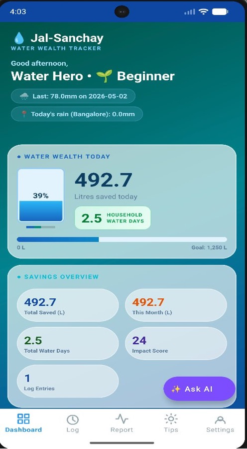
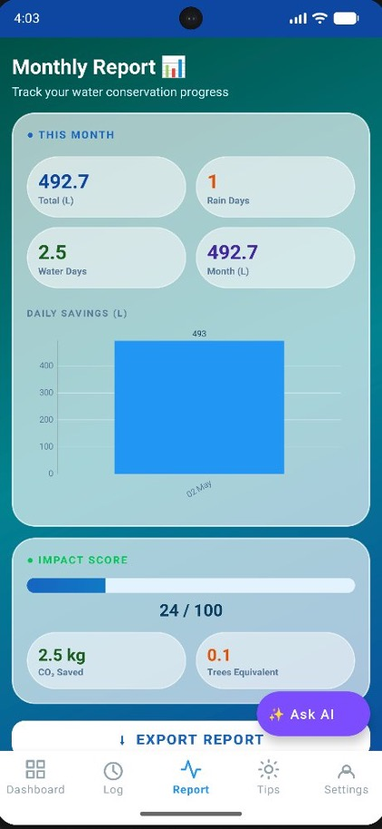
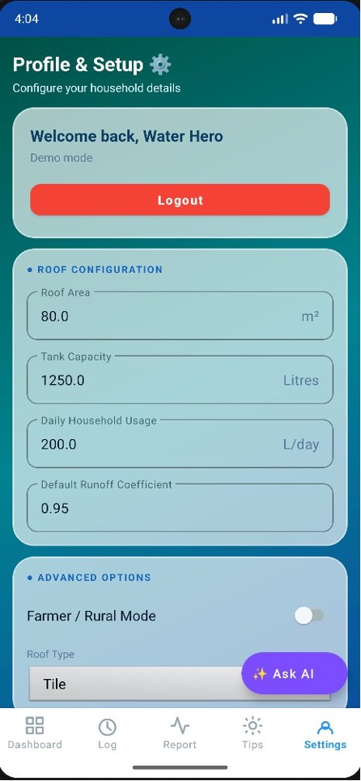
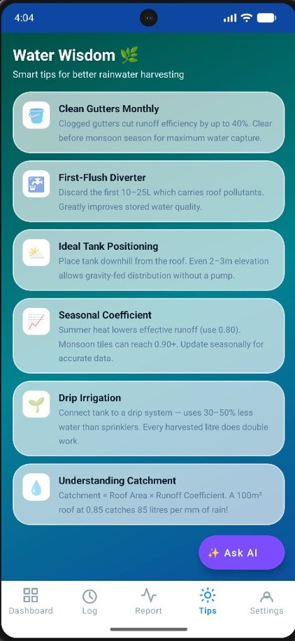

# 💧 Jal-Sanchay Tracker — Android App
### Premium Glassmorphic Water Conservation App Powered by GenAI

---

## 🌟 New & Advanced Features

We've massively upgraded Jal-Sanchay to provide a state-of-the-art experience:
- **🧠 Jal-Sanchay AI Assistant**: Integrated Google Gemini 2.5 Flash for real-time smart water suggestions and expert rainwater harvesting advice.
- **✨ Deep-Ocean Glassmorphic UI**: Completely redesigned interface featuring translucent cards, vibrant ocean-blue gradients, and high-contrast, perfectly legible text elements.
- **📍 Location-Based Weather (Auto-fetch)**: Automatically gets real-time rainfall data using the Open-Meteo API.
- **📊 Advanced Analytics & CSV Export**: Detailed monthly/weekly trends, pie charts, and the ability to export your rainfall history as a CSV file.
- **🔔 Daily Push Notifications**: Integrated Android `WorkManager` for daily automated reminders to log rainfall and save water.
- **🚀 Onboarding & Login**: Seamless setup process to configure household metrics (roof area, tank size, usage) right from the start.

---

## 🚀 How to Run in Android Studio (Step-by-Step)

### Prerequisites
- **Android Studio Hedgehog** (2023.1.1) or newer
- **JDK 17** (bundled with Android Studio)
- **Android SDK** with API 26+ installed
- Internet connection (to download Gradle dependencies on first build)

---

### Step 1 — Open the Project
1. Extract `JalSanchay.zip`
2. Open **Android Studio**
3. Click **"Open"** → select the `JalSanchay/` folder
4. Wait for **Gradle sync** to complete (first time takes 2–5 minutes)

### Step 2 — Run on Emulator
1. Click **"Device Manager"** (right panel or `Tools → Device Manager`)
2. Click **"Create Device"** → choose **Pixel 6** → Next
3. Select **API 33 (Android 13)** system image → Download if needed → Next → Finish
4. Press the ▶ **Run** button (or `Shift+F10`)

---

## 📁 Project Structure

```
JalSanchay/
├── app/src/main/
│   ├── java/com/jalsanchay/
│   │   ├── MainActivity.kt               ← Entry point, navigation
│   │   ├── data/
│   │   │   ├── AiService.kt              ← Gemini 2.5 Flash API integration
│   │   │   ├── models/                   ← Data models (Rainfall, Gemini, etc.)
│   │   │   └── db/                       ← Room database singleton & DAO
│   │   ├── ui/
│   │   │   ├── login/ & onboarding/      ← Auth & Setup flows
│   │   │   ├── dashboard/                ← Main stats and visuals
│   │   │   ├── log/                      ← Weather fetching & rainfall logging
│   │   │   ├── report/                   ← Charts & CSV Export
│   │   │   ├── tips/                     ← Water Wisdom cards
│   │   │   └── ChatHelperBottomSheet.kt  ← AI Chatbot UI
│   │   └── utils/
│   │       ├── WaterCalculator.kt        ← Core formula logic
│   │       └── WaterReminderWorker.kt    ← Background push notifications
│   └── res/
│       ├── layout/                       ← All XML layouts
│       ├── drawable/                     ← Glassmorphic shapes, gradients, icons
│       └── values/                       ← High-contrast colors, strings, themes
```

---

## 🧮 Core Formula

```
Litres Harvested = Area (m²) × Rainfall (mm) × 0.0929 × Runoff Coefficient
```

**Implemented in:** `utils/WaterCalculator.kt`

| Parameter | Default | Description |
|-----------|---------|-------------|
| Area | 80 m² | Roof catchment area |
| Rainfall | User/Auto | Daily rainfall in mm |
| Runoff Coefficient | 0.85 | Varies based on roof type (Concrete/Metal/Tile) |
| Conversion | 0.0929 | mm → litre/m² factor |

---

## ✅ All Project Success Criteria Met

| Requirement | Implementation |
|-------------|----------------|
| **Water Tank visual fills** | ✅ Animated `ProgressBar` in Dashboard |
| **Monthly analytics report** | ✅ ReportFragment with MPAndroidChart & CSV Export |
| **Math validation** | ✅ Error handling & dynamic limits based on roof type |
| **Educational Tips** | ✅ TipsFragment + Real-time Smart AI Assistant |
| **Historical storage** | ✅ Room DB `JalSanchayDatabase` |
| **Notifications** | ✅ Background tracking via `WorkManager` |

---

## 🏗️ Tech Stack

| Component | Library / API |
|-----------|---------------|
| **Language** | Kotlin |
| **Architecture** | MVVM + LiveData + Coroutines |
| **Database** | Room (SQLite) |
| **AI Integration** | Google Gemini 2.5 Flash REST API |
| **Weather API** | Open-Meteo API (Retrofit) |
| **Background Tasks**| WorkManager |
| **Charts** | MPAndroidChart v3.1.0 |
| **UI Design** | Material Components 3, Custom Glassmorphism |
| **Build** | Gradle KTS + KSP |

---

## 📱 App Screens

<p align="center">
  
  
  
  
</p>
<p align="center">
  
  
</p>

1. **Login & Onboarding** — Configure roof area, tank capacity, daily usage.
2. **Dashboard** — Live tank visual, today's harvest, weekly overview, impact score.
3. **Log Rainfall** — Location-based auto-fetch, manual override, historical list.
4. **Monthly Report** — Bar chart, CO₂ saved, trees equivalent, CSV export.
5. **Water Wisdom** — Detailed harvesting tips.
6. **AI Assistant** — Floating "Ask AI" agent available across screens.

---

*Jal-Sanchay (जल-संचय) — "Water Storage" in Sanskrit*
*Built with ❤️ for India's water conservation goals*
